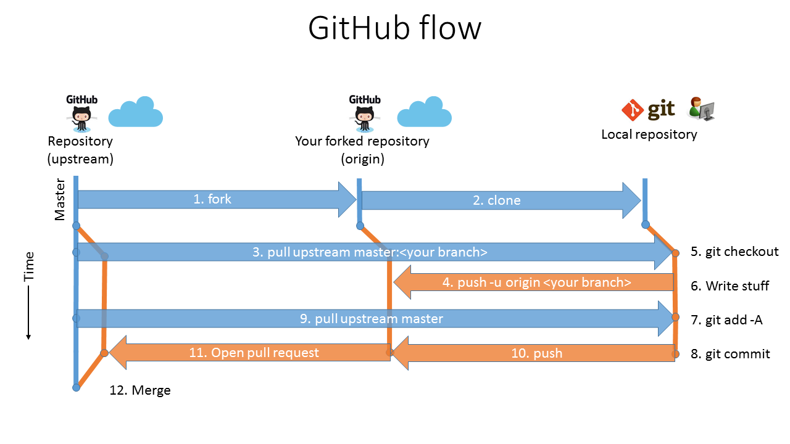

# Git and GitHub overview

## What is Git?
Git is an open source version control that facilitates big distributed projects. Git uses a distributed collaboration model. The distributed model is enabled through full copies of the repositories on each system. You can think of repositories as separate “projects”.

## What is GitHub?
GitHub is a web-based Git repository hosting service.  This provides a hosted location for internal and external contribution as well as deployment services for docs.microsoft.com content. 

## GitHub flow

If you work on open source projects on GitHub, the flow is called the *fork and pull* contribution model.  We follow the same model for publishing content. 

<video width="640" height="360" controls poster="./media/git-overview/github-flow.png">
  <source src="http://video.ch9.ms/ch9/b31e/8dfc66e6-a691-4cfb-be71-1bb615fab31e/GitHubFlowOverview_mid.mp4" type="video/mp4">
  
</video>

GitHub allows many people to contribute to a repository. Think of a repository as a discrete version control project.  In the diagram contribution workflow, there are three copies of the repository.  The *upstream* repository and the *origin* repository exist in GitHub. The local repository exists on your local computer.

Within a repository, there are branches. Everything in GitHub exists in a branch. A branch can be thought of as a working version of a repository. This enables everyone to make changes. The main *master* branch where all changes will eventually be merged. 

1. When you first start contributing to a repository, you need to *fork* it.  A fork is your personal copy of a repository in GitHub. Think of it as your sandbox on GitHub. Your forked remote repository is called *origin*. 

2. Cloning creates a local copy of a repository on your computer. When you *clone*, it will copy the master branch from *origin* into a directory on you local computer.

3. When working on changes, you need to create a new branch. Use the *pull* command to create a new branch in the local repository. Pulling from the upstream repository will copy the most current master branch into the new branch. This will reduce merge conflicts later.

4. Use the *push* command to sync the new branch to the origin repository. 

5. Use the *checkout* command to set the new branch as the current branch. Git will now track changes in the new branch.

6. Now you are ready to start making changes.  In the local directory created by the clone command, use your favorite markdown editor to modify, create, or delete markdown files.

7.  Use the *add* command to stage your modified files. Staging identifies the files you want to commit as a set of changes.

8. A commit snapshots a set of change in local git repository.  This allows you to roll back to previous commits if necessary.  Use the *commit* command to commit the staged files.

9. Use the *pull* command to copy the latest changes from upstream's master branch into the current working branch. If there are any merge conflicts, Git will notify of the conflicts.

10. Use the *push* command to sync your local branch to your origin repository.

11. In GitHub, open a pull request from the origin repository's working branch into the upstream repository's master branch. When you create the pull request, changes are highlighted for review. While the pull request is open, you can continue to push commits from your local branch.  For example, you may need to fix an error flagged by an automated check.

12. The pull request manager has the discretion to accept your pull request and merge it into master. When the pull request is merged, your changes are incorporated into the master branch.

## Resources

- [Git terminology](https://help.github.com/articles/github-glossary)
- [Git basics](https://git-scm.com/book/en/v2/Getting-Started-Git-Basics)
- [Learning Git and GitHub](https://help.github.com/articles/good-resources-for-learning-git-and-github/)

## Next steps

- [Repository organization](./repository-organization.md)
- Back to [contributors guide](./readme.md)