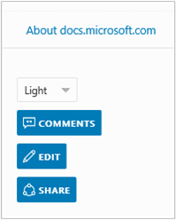

# Submitting minor contributions to an existing article

If you only need or want to make textual updates/corrections to an existing article, you can use GitHub's Web-based markdown editor to submit your changes. 

When you work in the GitHub UI, you are limited in terms of what you can do. Editing directly in the GitHub UI is **not recommended** for the following types of tasks:

 - Making major changes to an article
 - Creating and publishing a new article
 - Adding new images or updating images
 - Updating an article over a period of days without publishing changes each of those days

If you are performing complex tasks as listed above, review all the steps outlined in the [contributor's guide](./readme.md) for contributing and publishing changes.

## Using the GitHub editor

If you're looking for a quick way to make a minor contribution, you can do this directly in the GitHub Web page that corresponds to the article/file in which you would like to propose changes. This requires little/no knowledge of Git versioning workflow, and you can start this process by using either of the following methods:

- Visit the specific article on [https://docs.microsoft.com/](https://docs.microsoft.com/),  then click the **Edit** link in the upper-right corner of the article:
 
     

- Find the article by browsing the Markdown files in the related repository (See the [Repository organization](./repository-organization.md) for the list of repositories).  
 
Both of these will allow you to navigate directly into the GitHub page that serves the article source. 

1. Click the **Edit this file** pencil icon in the upper right to go into edit mode:

 

2. From here, you can specify your changes using the GitHub file editor.
- [Creating files on GitHub](https://github.com/blog/1327-creating-files-on-github)
- [Upload files to your repositories](https://github.com/blog/2105-upload-files-to-your-repositories)

3. When you're finished, scroll to the bottom of the page where you can **Propose file change**, which is the default option when you have read access to the repository. Users with read access will then be directed to a working branch in their own fork of the repository (GitHub will automatically create both the fork and branch for you, if either/both do not already exist), and be presented with a "Create pull request" page to create a new entry in the repository's pull request queue. For more information on the entire workflow, see the [Editing files in another user's repository](https://help.github.com/articles/editing-files-in-another-user-s-repository/) GitHub article.

## Next steps
- [Contributing and publishing](contributing-and-publishing.md)
- Back to [contributors guide](./readme.md)