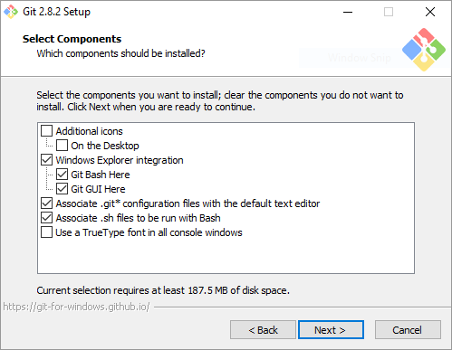
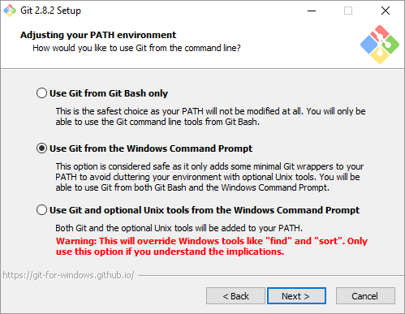
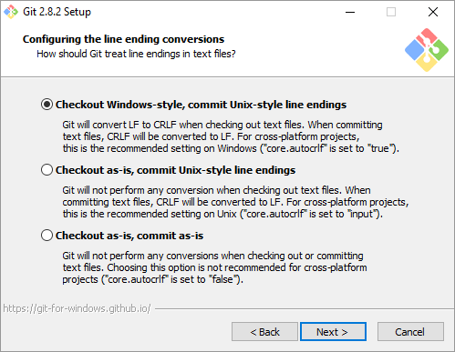
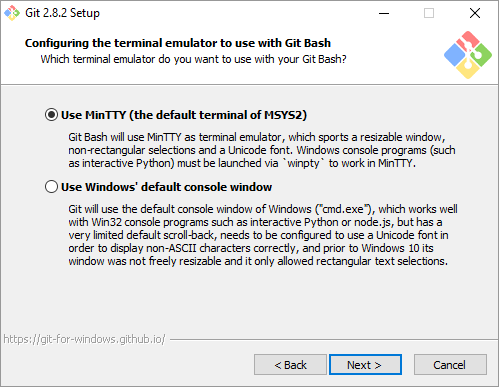
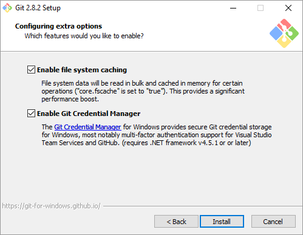

# Tools setup

## Install Git for Windows

1. Install [Software Freedom Conservancy's Git for Windows](https://git-scm.com/download/win). This installs the Git version control system, including Git Bash, the command-line app that you will use to interact with your local Git repository.

    You can accept all default settings, unless you want different behavior (ie: commands Git commands are available within the Windows command line, for instance).












> Note: If you prefer a Graphical User Interface over a Command Line Interface, see [Software Freedom Conservancy's available GUI Clients page](https://git-scm.com/downloads/guis), [GitHub's GitHub Desktop](https://desktop.github.com/), or [Visual Studio Code](https://www.visualstudio.com/products/code-vs.aspx) for some popular options. In this guide, we will focus on using the command line interface.

## Configure your user name and email

To ensure you are listed correctly as a contributor, you need to configure your user name and email locally in Git.

1. Launch the Git Bash command prompt. 

2. Configure your user name so it matches your name as you set it up in your GitHub profile:

    ````
    git config --global user.name "John Doe"
    ````
3. Configure your email so it matches the primary email designated in your GitHub profile.

    ````
    git config --global user.email "alias@mycompany.com"
    ````
4. Type `git config -l` and review your local settings to ensure the user name and email in the configuration are correct.

## Install a markdown editor
Content is authored in a simple "markdown" notation rather than complex "markup" (HTML, XML, etc.). You'll need to install a markdown editor. The following is a list of popular markdown editors.

- **[Visual Studio Code](https://www.visualstudio.com/products/code-vs.aspx)** - A lightweight but powerful source code editor which runs on your desktop and is available for Windows, OS X and Linux. 
- **[Atom](https://atom.io)**: GitHub's Atom Markdown editor. A license is **not** required for business use. It also includes spell checking. After installation, you'll need to set a few things up:
  - Atom defaults to using 2 spaces for tabs, but Markdown expects 4 spaces. If you leave it at the default of two, your article will look great in local preview, but not when it’s published. Configure Atom to use 4 spaces - you can find this setting under File>Settings>Editor Settings>Tab Length. 
  - You will probably also want to turn on Soft Wrap in this section too, which does the same as "word wrap" in Notepad. 
  - To turn on the markdown preview, click Packages>Markdown Preview>Toggle Preview. You can use Ctrl-Shift-M to toggle the preview HTML view.

> Note: In some cases, git bash will launch an editor. For example, if you forget to add a commit comment.  By default, the editor is vi. See [Associating text editors with Git](https://help.github.com/articles/associating-text-editors-with-git/) for details for configuring Atom. For VS code, the command is **git config --global core.editor "code --wait"**

## Next steps

- [Git and GitHub repository initial setup](git-and-github-repository-initial-setup.md)
- Back to [contributors guide](./readme.md)
